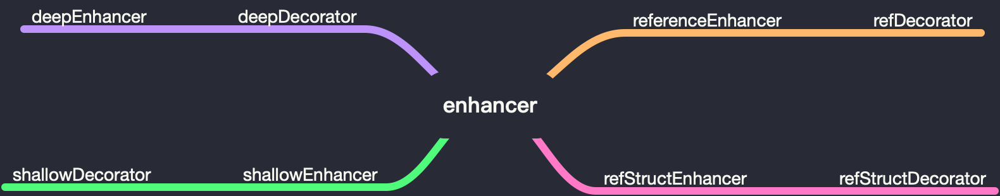

# Mobx 源码分析 - 热身

`mobx` 是一个简单、可扩展的状态管理库。

## 起步

首先打开 `mobx` 入口文件 `src/mobx.ts`，可以发现 `mobx` 的共放在四个文件夹内。

- `api` 文件夹， 公共模块的大多数静态方法
- `core` 文件夹，`mobx` 大多数算法的实现
- `types` 文件夹，存放可观察对象、数组和值的一些实现
- `utils` 文件夹，公共方法

文件向外部暴露了许多方法，比如我们经常使用的 `observable`、`action`、`computed` 和 `toJS` 等。

## observable

打开 `api/observable.ts` 文件，找到下面代码，可以发现 `observable` 实际上就是 `createObservable`，这里就是整个 `mobx` 的起点。

```js
export const observable: IObservableFactory &
    IObservableFactories & {
        enhancer: IEnhancer<any>
    } = createObservable as any
```

`mobx` 支持三种使用方法，一种为方法调用 `observable()`，一种为指定方法调用，比如 `observable.box()`，最后一种为装饰器 `@observable`。这三个区别是方法调用和装饰器调用会针对不同数据类型，实例化不同的构造函数。如果是数组，会返回一个 `Observable Array`。

### 指定方法调用


`observable` 属性上共定义 13 种方法，其中 `shallowBox`、`shallowArray`、`shallowMap` 和 `shallowObject` 已经废弃。`observable` 每一个属性对应的方法都会定义在 `observableFactories`。

```js
Object.keys(observableFactories).forEach(name => (observable[name] = observableFactories[name]))
```

如果调用这些已废弃方法，`mobx` 会自动帮你转换成对应的方法，并给出警告。比如：

```js
shallowBox<T = any>(value?: T, name?: string): IObservableValue<T> {
    if (arguments.length > 2) incorrectlyUsedAsDecorator("shallowBox")
    deprecated(`observable.shallowBox`, `observable.box(value, { deep: false })`)
    return observable.box(value, { name, deep: false })
}
```

`observableFactories` 属性中 `ref`、`shallow`、`deep`、`struct` 分别对应了 `mobx` 文件内四个 `decorator`，这几个 `decorator` 又对应着 `enhancer`。



`observable` 中每一个方法内部都会首先判断当前是否以 `decorator` 方式调用，如果是则会报错，最后返回其对应的构造函数的实例（`object` 除外）。比如：

```js
box<T = any>(value?: T, options?: CreateObservableOptions): IObservableValue<T> {
    if (arguments.length > 2) incorrectlyUsedAsDecorator("box")
    const o = asCreateObservableOptions(options)
    return new ObservableValue(value, getEnhancerFromOptions(o), o.name, true, o.equals)
}
```

在这里，`asCreateObservableOptions` 方法主要根据传递进来的 `options` 生成实例化 `ObservableValue` 所需参数。`getEnhancerFromOptions` 会根据所生成的参数来判断应该用哪一个 `enhancer`。如果传递进来的 `options` 上有 `defaultDecorator`，则使用 `options.defaultDecorator.enhancer`，否则判断传递进来的 `options` 上 `deep` 是否为 `false`，是则使用 `referenceEnhancer`，否则 `deepEnhancer`。

```js
function getEnhancerFromOptions(options: CreateObservableOptions): IEnhancer<any> {
    return options.defaultDecorator
        ? options.defaultDecorator.enhancer
        : options.deep === false
        ? referenceEnhancer
        : deepEnhancer
}
```

### 装饰器

`createObservable` 方法接收 3 个参数：`v`、 `arg2` 和 `arg3`，各对应原型对象、属性、描述符，如果不清楚为什么，可以在我的另一篇文章[解读 Babel 编译后的 decorator 代码](https://g-grant.github.io/Note/20190810.html)找到答案。

方法开始会判断第二个参数是否为 `string`，如果是则直接返回调用 `deepDecorator` 的结果。

```js
function createObservable(v: any, arg2?: any, arg3?: any) {
    if (typeof arguments[1] === "string") {
        return deepDecorator.apply(null, arguments)
    }
    ...
}
```

### 方法调用

判断传入的第一个参数是否已经是可观察，如果是则直接返回。如果不是，则根据不同的数据类型，进行不同的指定方法调用。如果都不是，则报错，并提示使用 `observable.box`。

```js
if (isObservable(v)) return v
const res = isPlainObject(v)
    ? observable.object(v, arg2, arg3)
    : Array.isArray(v)
    ? observable.array(v, arg2)
    : isES6Map(v)
    ? observable.map(v, arg2)
    : isES6Set(v)
    ? observable.set(v, arg2)
    : v
if (res !== v) return res
```
