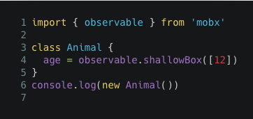
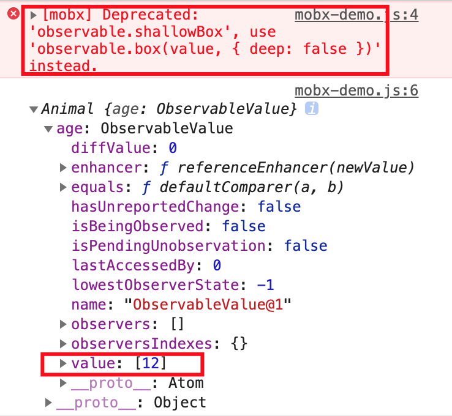
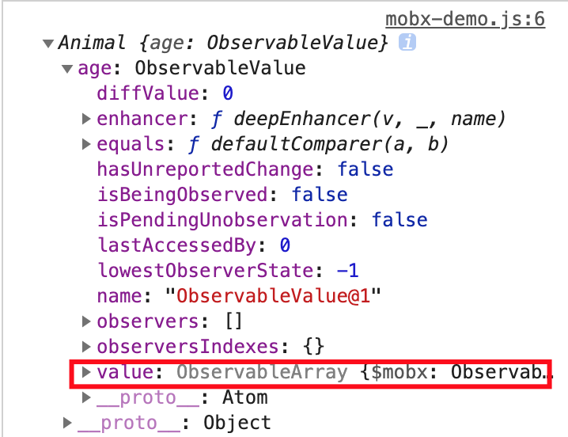
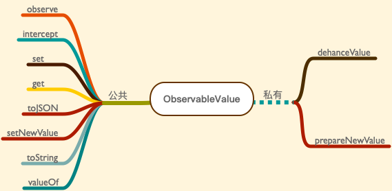

# Mobx 源码分析 - box

[上文](./20190822.md)提到，`observable` 上绑定了 13 个方法。此篇文章会重点讲解 `shallowBox` 和 `box`。

## shallowBox、box

当调用 `observable.shallowBox` 时，`mobx` 会给出废弃警告，并帮你转换成 `observable.box`，只是在转换的时候，会给 `observable.box` 传入第二个参数 `{ name, deep: false }`，这个参数的作用便是告诉 `observable.box` 在实例化 `ObservableValue` 时，使用 `referenceEnhancer`。

`referenceEnhancer` 禁用自动的 `observable` 转换，只是创建一个 `observable` 引用。





相反的，如果我们调用 `observable.box`，并给其传入 `{ deep: true }`。



可以看到，`value` 这时已经是 `ObservableValue` 的实例。

打开 `types/observablevalue.ts` 文件，该文件向外界暴露 `ObservableValue` 类和 `isObservableValue` 方法。

## ObservableValue

### 构造函数

1. `ObservableValue` 类继承 `Atom` 类。
2. `ObservableValue` 类的构造函数接收 5 个参数，分别为 `value`、`enhancer`、`name`、`notifySpy` 和 `equals`，其中 `name` 与 `equals` 存在默认值。`name`没什么好说的，就是一个 `id`，`equals` 的默认值为 `comparer.default`，`comparer.default` 主要用来判断两个值是否相等。
3. 调用下父类 `Atom` 构造函数，并把 `value` 值设为传递进来的 `enhancer` 函数执行的结果。
4. 判断是否需要监听和全局的监听器 `spy` 数量，如果有，则发送一个事件。
5. 类中定义了许多方法，比如 `dehanceValue`、`set`、`prepareNewValue`、`setNewValue`、`get`、`intercept`、`observe`、`toJSON`、`toString` 和 `valueOf`。
6. 类的原型上会针对对象转成原始值时，调用 `valueOf` 方法。

```js
ObservableValue.prototype[primitiveSymbol()] = ObservableValue.prototype.valueOf
```

### 方法

`ObservableValue` 类 8 个公共方法，2 个私有方法。



#### observe

接收一个回调函数 `listener` 和是否立即调用 `fireImmediately`。如果 `fireImmediately` 为 `true`，则立即调用 `listener` 函数。

调用 `registerListener` 注册监听器，方法内部大部分与 `registerInterceptor` 实现相同。

#### intercept

用来在任何变化应用前将其拦截。

方法内部调用 `registerInterceptor`，`registerInterceptor` 函数内部会判断实例上是否存在 `interceptors`，如果不存在，则赋为 `[]`，并把 `handler` 存入 `interceptors`。最后返回一个函数，且该函数只能被调用一次。

```js
export function registerInterceptor<T>(
    interceptable: IInterceptable<T>,
    handler: IInterceptor<T>
): Lambda {
    ...
    return once(() => {
        const idx = interceptors.indexOf(handler)
        if (idx !== -1) interceptors.splice(idx, 1)
    })
}
export function once(func: Lambda): Lambda {
    let invoked = false
    return function() {
        if (invoked) return
        invoked = true
        return (func as any).apply(this, arguments)
    }
}
```

#### get

返回当前值。

#### set

替换当前存储的值并通知所有观察者。

1. 方法内部首先取到以前的值 `oldValue`，然后调用 `prepareNewValue` 方法生成新值 `newValue`。
2. 判断 `newValue` 是否等于 `globalState.UNCHANGED`，如果等于什么都不做，如果不等于，则判断是否有监听器 `spy`，有则发送 `spyReportStart` 事件，没有则什么都不做。
3. 调用 `setNewValue` 方法
4. 有监听器则发送 `spyReportEnd` 事件

#### toJSON

返回 `this.get()`

#### setNewValue

1. 原来的值更新成传入的值
2. 发送更改事件
3. 判断是否有监听器 `listener`，如果有，调用 `notifyListeners` 方法

#### toString

返回 `${this.name}[${this.value}]`

#### valueOf

返回 `toPrimitive(this.get())`

#### dehanceValue

#### prepareNewValue

值得一提的是，方法内部会首先判断是否有拦截器 `interceptor`。

- 如果有则会依次调用拦截器方法，并判断拦截器是否返回对象或 nothing，如果不是则报错；如果是 nothing，则直接返回，下面的拦截器不再调用；如果是对象，则继续调用接下来的拦截器。

    ```js
    export function interceptChange<T>(
        interceptable: IInterceptable<T | null>,
        change: T | null
    ): T | null {
        const prevU = untrackedStart()
        try {
            const interceptors = interceptable.interceptors
            if (interceptors)
                for (let i = 0, l = interceptors.length; i < l; i++) {
                    change = interceptors[i](change)
                    invariant(
                        !change || (change as any).type,
                        "Intercept handlers should return nothing or a change object"
                    )
                    if (!change) break
                }
            return change
        } finally {
            untrackedEnd(prevU)
        }
    }
    ```

    如果返回的 `change` 为 nothing，则直接返回 `globalState.UNCHANGED`，否则取 `change.newValue` 作为新值。接下来方法和没有拦截器走的逻辑一致。

- 如果没有拦截器，则调用 `enhancer` 方法生成新值，最后判断旧值与新值是否相等，如果相等返回 `globalState.UNCHANGED`，否则返回新值。

## isObservableValue

`isObservableValue` 函数是 `createInstanceofPredicate` 函数返回值。

```js
var isObservableValue = createInstanceofPredicate("ObservableValue", ObservableValue);
```
